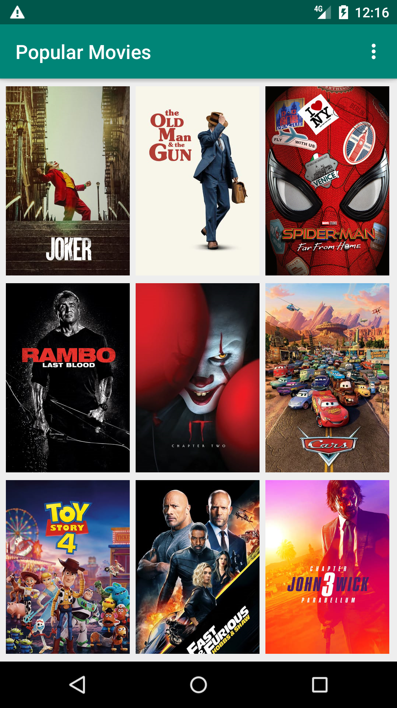
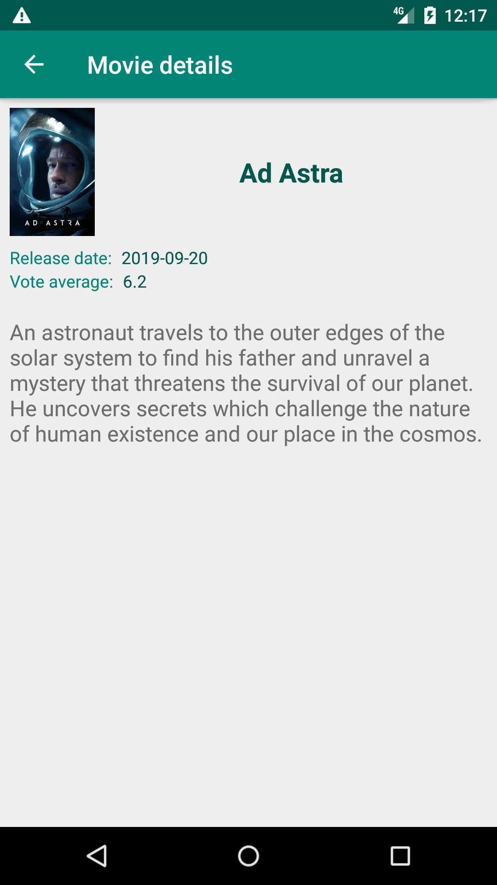

# Popular Movies Project

## API KEY info

The project uses The Movie Database API and needs a proper **API KEY**. 

You can request your own key from TMDb, see: https://www.themoviedb.org/faq/api

Insert the key into utilities/NetworkUtils.java file.

## Project Overview

**Popular Movies** app allows users to discover the most popular movies now playing. The app presents movie posters upon launch. User can change sort order via a setting. The sort order can be by most popular or by highest-rated. Tapping on a movie poster opens a details screen with additional information such as: original title, movie poster image thumbnail, a plot synopsis, user rating and release date.

The project is part of the Udacity course: **Android Developer Nanodegree Program**.

## Why this Project

The app includes the foundational elements of programming for Android. It communicates with the Internet and provide a responsive and delightful user experience.

## Project requirements
- Movies are displayed in the main layout via a grid of their corresponding movie poster thumbnails.
- UI contains an element to toggle the sort order of the movies by: most popular, highest rated.
- UI contains a screen for displaying the details for a selected movie.
- Movie details layout contains title, release date, movie poster, vote average, and plot synopsis.
- When a user changes the sort criteria (“most popular and highest rated”) the main view gets updated correctly.
- When a movie poster thumbnail is selected, the movie details screen is launched.
- In a background thread, app queries the /movie/popular or /movie/top_rated API for the sort criteria specified in the settings menu.

## Screenshots

 &nbsp;&nbsp; 

